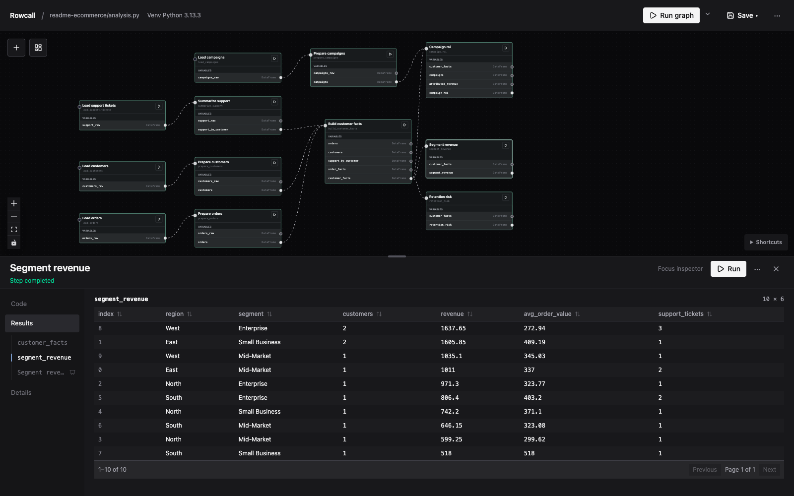

# Rowcall

Rowcall is a local visual workspace for Python data analysis. Write Python,
connect steps on a canvas, and inspect results as you go. Your analysis stays in
ordinary Python files you can edit directly or with a coding agent.



## Early beta

Rowcall is an early beta. Expect bugs and changes, and keep backups of important
work. Rowcall runs Python with your user permissions—only open code you trust.
Unsaved browser edits are lost if the app or browser closes.

## Install and try it

The official build requires **macOS** (Apple Silicon or Intel) and **Python 3.10
or newer**. The macOS binary is currently unsigned and not notarized.

Install the official build:

```sh
curl -fsSL https://rowcall.io/install.sh | sh
```

If the installer prints a PATH instruction, follow it before continuing. Then
start Rowcall from your terminal:

```sh
rowcall
```

The setup wizard guides you through naming your project, choosing where to save
it, and selecting Python packages. Rowcall creates a dedicated project
environment, installs your selections, and opens the workspace in your browser.

Run the starter node, inspect its results, then replace the sample code with
your own analysis. Each run executes its upstream steps fresh.

To return to your project, run `rowcall` from inside its folder.

To update, close running Rowcall processes and rerun the installer.

## Run from source

For developer setup and testing, see [Developing Rowcall](docs/development.md).
For more usage details and feedback, see the [documentation](docs/README.md).
